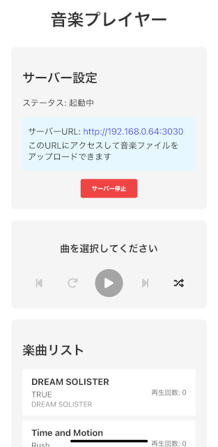
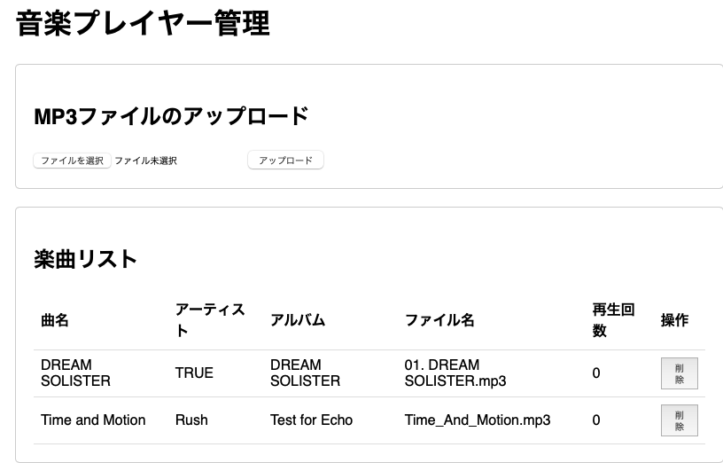

前回の記事では練習問題としての簡易的なMP3プレイヤーだったが、本記事では、すこしは実用的に使える機能を持ったMP3プレイヤーを作る。

具体的には、次の機能を持つ。

* Desktop(macOSで確認)とiOS(iPhone実機で確認)の上でマルチプラットフォーム動作するMP3プレイヤー。
    * たぶんAndroid, Windows, Linuxでも動く。
* HTTPサーバを内蔵していて、POST でMP3ファイルをブラウザからアップロード/削除できる。
* アップロードされたMP3ファイルはID3タグの情報をもとに、プレイリストとしてアプリ上から選択可能。
* 将来的には、プレイリスト、連続再生、ランダム再生などの機能を追加したい。

もともと、CDからリップしたMP3ファイルがたくさんあってそれを再生したいこと。
また、Spotifyなどのサブスクサービスだといつ楽曲が消えてしまうかわからないのでMP3ファイルとして手元においておきたいこと、電波が届かない僻地でも再生できるようにしたいこと、
などの理由からMP3プレイヤーが欲しいと思っていた。
しかし、現代はサブスク主流であり、シンプルに手持ちのMP3ファイルを再生する、というプレイヤーがなかったので自作。
いちど自作すると、自分が好みのように機能を段階的に実装して、育てていくというプラットフォームになって具合良い。

今回はコード生成に定評がある Claude 3.7 Sonnet の助けを借りた。
JavaScript/React部はだいぶ上手に生成できると思うが、Rust部はそのままではビルドが通らなかったり、期待した機能が動作しないような状態だった。
幸い、コンパイラのエラーメッセージ、RustAnalyzerが提供する型情報や補完、docs.rsの文書などを参考に、なんとか動くようにできた。
RustについてはAIよりも公式環境のほうが現時点では優れている、ということのようだ。

実際のコードは[https://github.com/nkon/tauri-music-player]を参照してください。


## Claude 3.7 Sonnetによるプロトタイプの生成

次のようなプロンプトを与えてプロトタイプを生成させる。

```
Tauri2.0 でiOSとMacのマルチプラットフォームで動く音楽プレイヤーのアプリを作りたいです。
バックエンドはRust、フロントエンドはReact+JavaScriptを使います。

仕様

* ローカルストレージに保存されたMP3ファイルを再生する。
    * iOSでは適切にローカルストレージに対するアクセス権限を付与する。
* メイン再生画面では楽曲リスト(ローカルストレージに保存された楽曲)を表示する。
    * リストにはファイル名の他ID3タグから抽出された、曲名、アルバム名、アーティスト名が表示される。
    * リストのアイテムをタップまたはクリックするとその曲が再生される。
* 一時停止、停止、再生、次の曲に進む、今の曲を最初から、の操作ボタンを持つ。
* 曲の再生が終了すると、リストの次の曲、またはランダムに選択した曲を再生する。
* ネットワーク経由で楽曲ファイルをアップロードできるようにHTTPサーバ機能を持つ。
    * このアプリは、自身のIPアドレスとポートを表示してHTTPサーバのURLを表示する。
    * 表示されたHTTPサーバにアクセスするとPOSTを利用したファイルアップロードフォームが表示される。
    * フォームには楽曲リストが表示され、HTTPフォーム経由でファイルを削除することもできる。

フロントエンド(React+JavaScript)とバックエンド(Rust)はTauri2.0のAPIで通信する。

バックエンド部は次のAPIを備え、フロントエンド側はそれを呼ぶ。

* 楽曲リストの取得
* 楽曲の再生回数の記録
* HTTPサーバの開始と停止

楽曲ファイルのアップロード機能(フォームの送信、POSTされたファイルの保存、ファイルの削除)はバックエンド(Rust)で実装する。
```

実際には、そのままでは動かないので、自分で生成したプロジェクトに、段階的に貼り付けながら動作確認を行い、必要な修正を施していく。

## プロジェクトの生成

```
❯ pnpm create tauri-app
✔ Project name · tauri-music-player
✔ Identifier · com.tauri-music-player.app
✔ Choose which language to use for your frontend · TypeScript / JavaScript - (pnpm, yarn, npm, deno, bun)
✔ Choose your package manager · pnpm
✔ Choose your UI template · React - (https://react.dev/)
✔ Choose your UI flavor · JavaScript

Template created! To get started run:
  cd tauri-music-player
  pnpm install
  pnpm tauri android init
  pnpm tauri ios init

For Desktop development, run:
  pnpm tauri dev

For Android development, run:
  pnpm tauri android dev

For iOS development, run:
  pnpm tauri ios dev

❯ cd tauri-music-player

❯ pnpm install

❯ pnpm tauri ios init

❯ pnpm tauri dev
```
ビルドが始まって、デスクトップアプリが開発サーバのもとで起動する。開発サーバのもとで動作している場合、フロントエンドのファイルを修正すると、即座に反映される。

```
❯ pnpm tauri ios dev

…

/xxx/tauri-music-player/src-tauri/gen/apple/tauri-music-player.xcodeproj: error: Signing for "tauri-music-player_iOS" requires a development team. Select a development team in the Signing & Capabilities editor. (in target 'tauri-music-player_iOS' from project 'tauri-music-player')
note: Run script build phase 'Build Rust Code' will be run during every build because the option to run the script phase "Based on dependency analysis" is unchecked. (in target 'tauri-music-player_iOS' from project 'tauri-music-player')
** BUILD FAILED **


The following build commands failed:
        Building workspace tauri-music-player with scheme tauri-music-player_iOS and configuration debug
(1 failure)
command ["xcodebuild"] exited with code 65
    Error command ["xcodebuild"] exited with code 65
 ELIFECYCLE  Command failed with exit code 1.
```
iOSアプリの場合、開発TEAM IDをセットすることが必要。

Xcodeを起動してDevelopment Teamを設定する
```
❯ open src-tauri/gen/apple/tauri-music-player.xcodeproj

❯ pnpm tauri ios dev
```
こんどは、USB接続したiPhone上でデモプログラムが起動した。
※本当はシミュレータで動いて欲しいのだが、物理iPhoneが登録されていると、それが優先されてしまうみたい。

`src-tauri/gen/apple/tauri-music-player.xcodeproj/project.pbxproj`はTEAM IDが登録されているのでGitで公開してはならない。

```
❯ pnpm tauri ios build
```
`tauri-music-player/src-tauri/gen/apple/build/arm64/tauri-music-player.ipa`を実機iPhoneにAirDropしたら正常にインストールされて起動した。

ここまでが、プロジェクトの作成。

### iPhone実機での実行

* 開発者アカウントの取得。$99/年 の支払い。国をまたぐ場合は、サブスクが続いていると国をまたいでの変更が困難なので注意。
* App IDの確認(Developer -> ID -> 選択)
* Certificateのダウンロード(Developer -> 証明書 -> 選択 -> Download)
* Profileのダウンロード(Developer -> Profiles -> 選択 -> Download)
* App IDを環境変数`TAURI_APPLE_DEVELOPMENT_TEAM`にセット
* Certificateを環境変数`IOS_CERTIFICATE`にセット
    * base64 -i development.cer | pbcopy
* Profileを環境変数`IOS_MOBILE_PROVISION`にセット
    * base64 -i Generic_Provisioning_Profile.mobileprovision| pbcopy
* source ~/ios_dev_env

#### iPhoneを開発者モードにする

* 設定->プライバシーとセキュリティ-> ディベロッパーモード -> ON
    * 再起動が必要


## フロントエンドの作成

Claudeが生成したコードをプロジェクトに貼り付けながら動作確認する。

基本的に素直な構成。HTTPサーバの制御をする`ServerControls`, プレイヤー本体の`PlayerControls`, 曲リストの`TrackList`のコンポーネントを作成し、`App.jsx`に貼り付ける。

* src/
    * components/
        * PlayerControls.css
        * PlayerControls.jsx
        * ServerControls.css
        * ServerControls.jsx
        * TrackList.css
        * TrackList.jsx
    * App.css
    * App.jsx
    * index.css
    * main.jsx

生成されたコードは再生ボタンのアイコンなどに`react-icons`を使っていたのでインストールする。

```
❯ pnpm install react-icons
```

`pnpm tauri dev`で開発サーバにぶら下がったWebViewのデスクトップアプリが起動する。

フロントエンドのファイルを修正すれば、それが即座に画面に反映されるので非常に便利。

また、右クリック→要素の詳細を表示、でChromeのような開発者ツールが起動するので、エラーメッセージなどの詳細を確認できる。


アプリっぽい画面の表示は、細かい修正のみでOKだった。

問題点として、iOSで実行したときにアイコンサイズが非常に小さくなってしまった。
あまりReactに詳しくないので、これもClaudeに聞いて解決。

```
iosの場合、プレイヤーのFAアイコンが非常に小さくなってしまうのを通常の大きさに表示したい
---
iOSでアイコンが小さく表示される問題は、iOSのレスポンシブ設計の特性によるものです。この問題を解決するには、アイコンのサイズを明示的に指定し、iOSでも適切に表示されるようにCSS設定を調整する必要があります。
PlayerControls.cssファイルを以下のように修正してみてください：
```


ただし、このままでは再生ファイルが無いので実際の楽曲再生はできない。

## バックエンドの作成

バックエンドのコードもClaudeがRustのコードを生成している。しかし、そのままでは動かないので修正が必要。

基本的に、HTTPサーバが動作して、フロントエンドからコマンドで操作できるようになっている。

RustでのウェブフレームワークはActixがメジャーだがClaudeが生成したのはWarpベースのもの。情報が少ないのでググるのが大変だが、軽量で使いやすそうで良い感じだ。

* src-tauri/
    * src/
        * commands.rs # Tauriコマンドを定義
        * http.rs     # HTTPサーバ本体
        * lib.rs      # ライブラリのエントリポイント
        * main.rs     # バイナリのエントリポイント
        * music.rs    # MP3ファイルを保存するディレクトリとID3タグを扱う

### データ用ディレクトリ

スマホアプリも考慮すると、MP3ファイルを格納するディレクトリはOSのルールに従わなければならない。

次のように`app_data_dir()`を使うと適切なディレクトリを取得できる。
[https://docs.rs/directories/6.0.0/directories/struct.BaseDirs.html#method.data_dir]

* macOSの場合は`~/Library/Application\ Support/com.tauri-music-player.app/`
* Linuxの場合は`~/.local/share/com.tauri-music-player.app/`
* Windowsの場合は`C:\Users\Alice\AppData\Roaming`

ファイルアップロード機能が未実装であっても、ここにファイルを置けば、デスクトップアプリの場合はファイルリストに反映される。

```rust
pub fn get_music_dir(app_handle: &AppHandle) -> Result<PathBuf, io::Error> {
    let app_dir = app_handle.path().app_data_dir().map_err(|_| {
        io::Error::new(io::ErrorKind::NotFound, "Could not find app data directory")
    })?;
    Ok(app_dir.join("music"))
}
```

ファイルからID3タグ情報を抽出する部分は、自動生成ではうまくいかなかったので書き直す必要があった。

### local-ip-address

本アプリでは、アプリの画面で、内部で起動しているWebサーバのURLを表示し、ブラウザでそのURLにアクセスすることでMP3ファイルをアップロードする。

そのためにはRustバックエンドはWeb Serverのアドレスを知り、フロントエンド側に通知する必要がある。

Claudeが提示したコードは`local-ip-address`というクレートを用いてローカルアドレスを取得していた。

```rust
    // ローカルIPアドレスの取得
    let ip = local_ip_address::local_ip().map_err(|e| e.to_string())?;
```

デスクトップ環境で実行した場合はうまくいっていたが、iPhone実機で実行したときはWiFiではなくセルラーのIPアドレスを表示してしまう。これではWiFiに接続しているパソコンからアクセスできない。

実はもとの`local-ip-address`のバグ。セルラーのインターフェイスの場合は無視して、ローカルのIPアドレスを取得する意図のコードになっていたが、実際にはAndroidの場合のみ考慮されていてiOSの場合は考慮されていなかった。

`local-ip-address`をローカルにクローンして修正して用いる。上流にはPull Requestを送信しておいた。

```
local-ip-address = {version = "0.6.3", path = "../../local-ip-address" }
```

[https://github.com/nkon/local-ip-address/commit/926fe9229c286663825da594593980b3516a50f8]

### Warp Web Server

WarpでWeb Serviceを作る場合、URLごとにハンドラを登録するような構成になる。今回の場合は次のようになる。

* GET http://xxxxxx:xxx/ -> handle_index
* POST http://xxxxxx:xxx/upload -> handle_post
* POST http://xxxxxx:xxx/delete -> handle_delete
* GET http://xxxxxx:xxx/stream -> handle_stream(後述)

### ファイルアップロード

ID3タグの読み込みについての修正は必要だったが、データディレクトリのMP3ファイルを読み込んでリスト化してウェブの画面に表示するところは、Claudeのコードがスムーズに動作した。

しかし、ファイルアップロードについてはClaude生成コードはマルチパートメッセージの扱いが悪く、docs.rsを読んでイチから実装する必要があった。

POSTされた情報は`FormData`にマルチパート形式で入っている。`try_next()`を使って目的のコンテンツがやってきたら、そのパートを目的のファイルに`save_file()`で保存する。`save_file()`は入力をチャンクごとに分割して非同期で処理するようになっている。

とくに自動生成のコードは、型の整合性やエラー処理については、雰囲気で生成しているような感じであり、コンパイラに怒られる。

```rust
async fn handle_upload(mut form: FormData, app_handle: AppHandle) -> Result<impl Reply, Rejection> {
    let music_dir = get_music_dir(&app_handle).map_err(|e| {
        eprintln!("Error getting music directory: {}", e);
        warp::reject::custom(ServerError(e.to_string()))
    })?;

    while let Ok(Some(part)) = form.try_next().await {
        let file_name = match part.filename() {
            Some(file_name) => file_name.to_string(),
            None => {
                return Ok(Response::builder()
                    .status(StatusCode::INTERNAL_SERVER_ERROR)
                    .body("ファイルが見つかりません".to_string()));
            }
        };

        // MP3ファイルのみ許可
        if !(file_name.ends_with(".mp3")  || file_name.ends_with(".MP3")){
            continue;
        }

        let file_path = music_dir.join(file_name);
        if let Err(e) = save_file(part, &file_path).await {
            eprintln!("Error saving file: {}", e);
            return Ok(Response::builder()
                .status(StatusCode::INTERNAL_SERVER_ERROR)
                .body(format!("ファイルの保存に失敗しました: {}", e)));
        }
    }

    // アップロード完了後、インデックスページにリダイレクト
    Ok(Response::builder()
        .status(StatusCode::FOUND)
        .header("Location", "/")
        .body("".to_string()))
}

async fn save_file(mut part: Part, file_path: &Path) -> Result<(), String> {
    let mut file = File::create(file_path).map_err(|e| e.to_string())?;

    while let Some(chunk) = part.data().await {
        file.write_all(chunk.unwrap().chunk())
            .map_err(|e| e.to_string())?;
    }

    Ok(())
}
```

### MP3ストリーミング

データディレクトリに保存されたMP3ファイルをReactフロントエンドから使うのは一筋縄では行かない。

[簡単サンプル](https://nkon.github.io/Tauri-Player1/)の場合は、ソースツリーの`public/audio/xxx.mp3`に入れおておけば、バイナリに埋め込まれて`audio/xxx.mp3`としてフロントエンドから参照できた。しかし、任意のファイルの場合はそうはいかない。

* TauriのFile Systemプラグインを使う。
* Tauriのコマンド(フロントエンド-バックエンド通信)を利用して、MP3のデータをBLOBとして渡す。
* HTTPサーバがローカルから読み取って、フロントエンドはHTTPサーバ経由でデータを取得する。

1番目の案の場合、フロントエンドからローカルのMP3ファイルのパスを知ることはできるが、HTMLのAudioElementは`asset://`プロトコルでソースツリーから埋め込まれたファイルにしかアクセスできない。

2番目の場合、MP3ファイルが大きい場合、メモリを消費してしまう。通常のファイルサイズだと問題ないとも言えるのだが。

今回は3番目の案を実装する。この場合は非同期ストリーミングAPIが使われるので、必要に応じてデータが読み込まれて送信され、ファイルすべてが一気にメモリに読み込まれることはない。

ただし、この場合はWiFiが無い環境ではHTTPサーバのIPアドレスが取得できないので、楽曲再生ができない。MP3ストリーミング用に`localhost`でHTTPサーバをもう一本立てる。ファイルアップロード用のHTTPサーバはWiFiのアドレスで起動してなければならない。

ストリーミングで楽曲データをフロントエンドに提供する場合、フロントエンドでの楽曲ファイルの指定は次のようになる。

```jsx
    const url = await invoke('get_server_url');
    audioRef.current.src = url + "/stream/" + track.id;
    audioRef.current.play();
    setIsPlaying(true);         // 再生ボタンの状態に反映させる
```
バックエンドのハンドラはこのような感じ。

* Rustの文字列はUTF-8だがパスはUTF-8ではない部分もあるので`Path`, `PathBuf`で取り扱う。
* TokioのStream APIを使って非同期でストリーミングしている。

```rust
async fn handle_stream(file_id: String, app_handle: AppHandle) -> Result<impl Reply, Rejection> {
    let music_dir = get_music_dir(&app_handle).map_err(|e| {
        eprintln!("Error getting music directory: {}", e);
        warp::reject::custom(ServerError(e.to_string()))
    })?;

    let file_id = decode(&file_id).unwrap().into_owned();

    // let sanitized_id = sanitize_filename::sanitize(&file_id);
    let sanitized_id = file_id;

    // ディレクトリトラバーサル対策
    if sanitized_id.contains("..") {
        return Err(warp::reject::not_found());
    }

    let file_path = music_dir.join(&sanitized_id);

    if !file_path.exists() || !file_path.is_file() {
        return Err(warp::reject::not_found());
    }

    let file = tokio::fs::File::open(file_path).await.map_err(|e| {
        eprintln!("Error opening file: {}", e);
        warp::reject::custom(ServerError(e.to_string()))
    })?;

    let stream = tokio_util::io::ReaderStream::new(file);

    Ok(Response::builder()
        .status(StatusCode::OK)
        .header("Content-Type", "audio/mpeg")
        .body(warp::hyper::Body::wrap_stream(stream)))
}
```

### Info.plist

iOSアプリの場合、デフォルトの権限が非常に制限されている。アプリ個別に許可を与える必要がある。

Xcodeを開いてInfo.plistを編集する。ソースツリー上では"tauri-music-player/src-tauri/gen/apple/tauri-music-player_iOS/Info.plist"にある。

https://developer.apple.com/library/archive/documentation/General/Reference/InfoPlistKeyReference/Articles/iPhoneOSKeys.html

```xml
<key>LSApplicationCategoryType</key>
    <string>public.app-category.music</string>
<key>UIBackgroundModes</key>
	<array>
		<string>audio</string>
	</array>
<key>LSSupportsOpeningDocumentsInPlace</key>
    <true/>
<key>UIFileSharingEnabled</key>
    <true/>
<key>NSAppTransportSecurity</key>
	<dict>
		<key>NSAllowsArbitraryLoads</key>
		<true/>
	</dict>
```
* LSApplicationCategoryType: public.app-category.music
  * Launch Services Keys
    * App Category: Music
* UIBackgroundModes: audio
  * iOS Keys
    * Required Background Modes: item0=App plays audio or streams audio/video using AirPlay
    * バックグラウンド実行を許可
* LSSupportsOpeningDocumentsInPlace: True
  * iOS Keys
    * Supports opening documents in place
    * ローカルファイルを開くことを許可
* UIFileSharingEnabled: True
  * iOS Keys
    * Application supports iTunes file sharing
* NSAppTransportSecurity -> NSAllowsArbitraryLoads: True
    * App Transport Security Setting: item0=Allow Arbitrary Loads=True
    * デフォルトではHTTPは許可されていないので許可させる


### 動作確認

アプリの画面。デザインはいかにも試作アプリだが、機能は理解してもらえるだろう。

一番上が`ServerControls`、次が`PlayerControls`、最後が`TrackList`だ。



ブラウザから上記のサーバURLを開いた状態。

POSTフォームを使ってファイルのアップロード。リストからファイルの削除ができる。

通常はパソコンなどからファイルをアップロードするが、ファイルの削除はアプリからスマホ内蔵ブラウザを呼び出しても実行できる。原理的にはスマホ内蔵ブラウザからアップすることもできるが、あまり意味がない行為だ。




### 将来の拡張

レーティングやランダム再生については、[過去記事](https://nkon.github.io/Tauri-Todo-Plugin-Sqlite/)でも述べたように、TauriのSQLプラグイン経由でSQLiteを使い、機能についてはフロントエンド側で実装することになるだろう。

